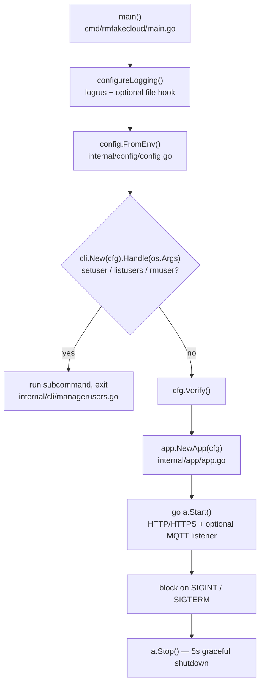
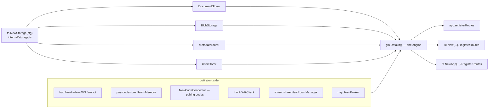
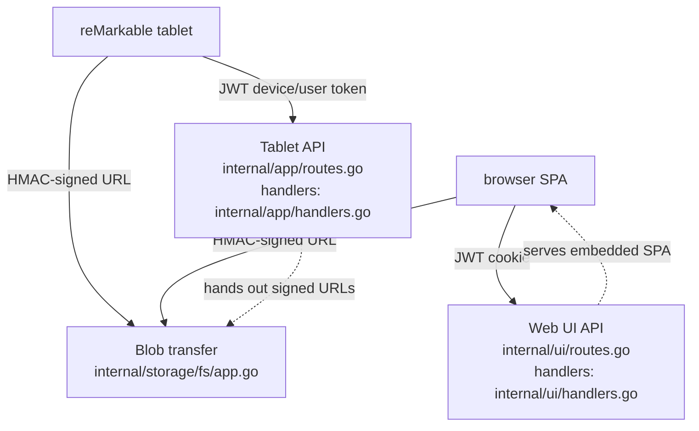
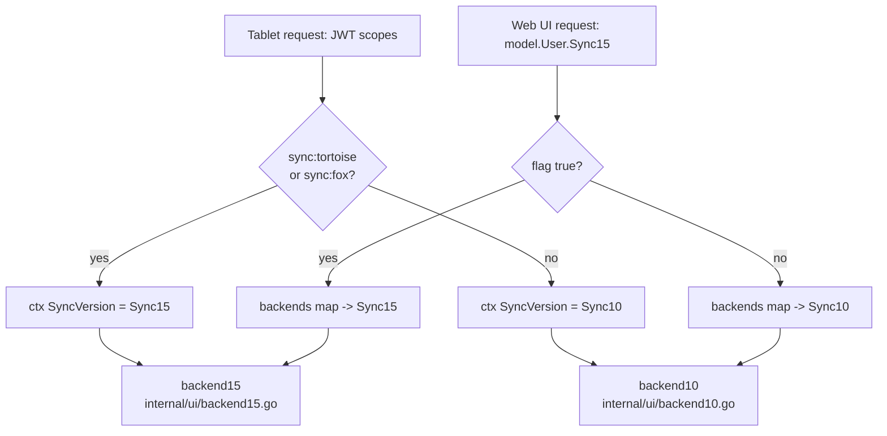
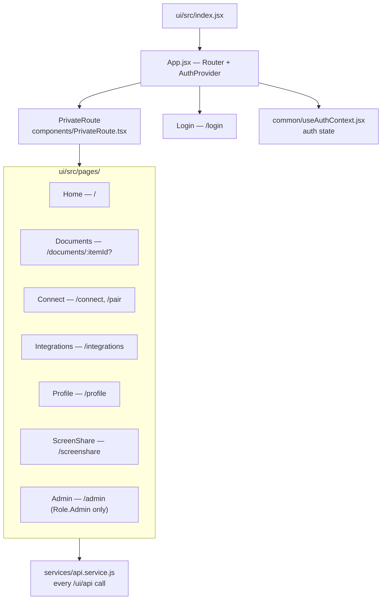

# Architecture

An orientation map of the codebase: where execution starts, how it is laid out, and
which file owns which feature. Terse by design — every section is a diagram plus
pointers.

!!! info "One binary, three audiences"
    A single Go process serves the **tablet** (reMarkable sync/auth APIs), the **browser**
    (embedded React SPA), and **blob transfer** (signed-URL endpoints the other two point
    at). Storage is plain files on disk — there is no database.

## 1. Boot chain

Entry point is `cmd/rmfakecloud/main.go` → `main()`.



All configuration is environment variables. The `env*` consts in
`internal/config/config.go` are the authoritative list; `--help` prints them via
`config.EnvVars()`.

## 2. Composition root

`app.NewApp` (`internal/app/app.go`) builds everything and wires it together. The key
move: **one** `fs.NewStorage(cfg)` value is handed out under four different interfaces
(declared in `internal/storage/storage.go`).



If no users exist on startup, `cfg.CreateFirstUser` is flipped on and the first login
creates an admin.

## 3. Three route groups on one engine

Everything is mounted on the same `gin.Engine`, but the groups differ in **how they
authenticate** — the fastest way to tell which world a handler belongs to.



| Group | Registered in | Auth | Serves |
| --- | --- | --- | --- |
| Tablet API | `internal/app/routes.go` | `app.authMiddleware()` — JWT, `internal/app/middleware.go` | `/token/json/2/*`, `/document-storage/json/2/*`, `/sync/v2` `v3` `v4/*`, `/api/v1/signed-urls/*`, `/integrations/v1` `v2/*`, HWR, email, screenshare, `/notifications/ws/json/1` |
| Blob transfer | `internal/storage/fs/app.go` | HMAC-signed token in the URL — **not** a JWT | `/storage/:token`, `/blobstorage` |
| Web UI | `internal/ui/routes.go` | cookie JWT (`WebUserClaims`) + `adminMiddleware()` on `/users*` | `/ui/api/*`, static SPA at `/assets`, `NoRoute` → `index.html` |

Unauthenticated odds and ends: `/health`, `/discovery/v1/endpoints`,
`/discovery/v1/webapp`, `/service/json/1/:service`, `/favicon.ico`, `/robots.txt`, and the
telemetry sinks (`/v1/reports`, `/v2/events`, … → `app.nullReport`).

## 4. The sync 1.0 / 1.5 split

The one structural fact that makes the codebase feel doubled. Two sync protocols coexist
and almost every document-touching path branches on which is in play.



Tablet side: `app.authMiddleware()` reads the JWT scopes and sets `SyncVersion` in the gin
context (`internal/app/middleware.go`). Web side: `getBackend` (`internal/ui/handlers.go`)
looks the user's flag up in the `backends` map built in `internal/ui/ui.go`.

| | sync 1.0 | sync 1.5 ("sync15") |
| --- | --- | --- |
| Unit of transfer | whole-document zip | content-addressed blobs + hash tree |
| Metadata | `.metadata` files | entries inside the hash tree |
| UI backend | `internal/ui/backend10.go` | `internal/ui/backend15.go` |
| Storage | `internal/storage/fs/documents.go`, `metadata.go` | `internal/storage/fs/blobstore.go` |
| Models | `messages.RawMetadata` | `internal/storage/models/hashtree.go`, `hashdoc.go`, `hashentry.go` |
| Versioning | document `Version` int | root generation numbers in `.root.history` |

Hash tree schema version 3 vs 4 is selectable with `HASH_SCHEMA_VERSION`.

!!! warning
    A feature that touches documents usually has to be implemented in **both** backends.
    Check the `backend` interface in `internal/ui/ui.go` — if your change fits there, both
    sides need it.

## 5. On-disk layout

Rooted at `$DATADIR` (default `./data`).

```
data/
└── users/
    └── <uid>/
        ├── .userprofile          user record + integrations  (fs/userstorage.go)
        ├── <docid>.zip           sync 1.0 document
        ├── <docid>.metadata      sync 1.0 metadata
        └── sync/                 sync 1.5 only
            ├── <blob-hash>       content-addressed blobs
            ├── root              current root hash
            ├── .root.history     generation log
            └── .tree             cached hash tree  (fs/blobstore.go)
```

Every UID and file name goes through `common.Sanitize` / `common.SanitizeUid`
(`internal/common/common.go`) before touching the filesystem. Keep doing that for any new
path construction.

## 6. Feature → file index

### Backend

| Feature | Lives in |
| --- | --- |
| Device registration, token issue/renew | `internal/app/handlers.go` (`newDevice`, `newUserToken`, `deleteDevice`); claim shapes in `internal/app/claims.go` and `internal/messages/auth0.go` |
| Device pairing code | `internal/app/codeconnector.go` |
| Passcode (PIN) reset flow | `internal/app/passcode.go`, `internal/app/passcodestore/`, UI half in `internal/ui/passcode.go` |
| Sync 1.0 document CRUD | `internal/app/handlers.go` (`listDocuments`, `uploadRequest`, `updateStatus`, `deleteDocument`), `internal/storage/fs/documents.go` |
| Sync 1.5 blobs, roots, signed URLs | `internal/app/handlers.go` (`blobStorage*`, `syncGetRootV3`/`V4`, `syncUpdateRootV3`, `checkFilesPresence`), `internal/storage/fs/blobstore.go`, `internal/storage/models/` |
| Notifications (WebSocket fan-out) | `internal/app/hub/hub.go` |
| MQTT (newer firmware transport) | `internal/mqtt/broker.go`; WS bridge at `app.handleMQTTWebSocket` |
| Screenshare / WebRTC signalling | `internal/screenshare/rooms.go`; handlers in both `internal/app/handlers.go` and `internal/ui/handlers.go`; ICE servers via `ICE_SERVERS` |
| Send-by-email | `app.sendEmail` in `internal/app/handlers.go`, SMTP in `internal/email/smtp.go` |
| Handwriting recognition (MyScript proxy) | `internal/hwr/client.go` |
| Integrations (localfs, ftp, webdav, dropbox, ics, webhook) | `internal/integrations/` — interfaces in `integrations.go`, one file per provider; per-user config lives in the user profile |
| PDF render / annotation export | `internal/storage/exporter/pdf.go` (unipdf + rmapi). `license.go` uses `go:linkname` to inject the community licence key — **do not "clean it up"** |
| User management from the shell | `internal/cli/managerusers.go` (`setuser`, `listusers`, `rmuser`) |
| Config / env vars | `internal/config/config.go` |

### Front end (`ui/`)

Vite + React 18, react-router v5, react-bootstrap. Built to `ui/dist` and embedded into
the binary by `ui/assets.go` (`//go:embed dist/*`).



## 7. Where do I add X

**A new tablet endpoint** — route inside the `authRoutes` group in
`internal/app/routes.go`, handler in `internal/app/handlers.go`. Read the user with
`userID(c)` and the protocol with `getSyncVersion(c)`.

**A new web UI endpoint** — route in `internal/ui/routes.go` (under `auth`, or under
`admin` if it is admin-only), handler in `internal/ui/handlers.go`. If it touches
documents, go through `app.getBackend(c)` so both sync versions work — which means adding
the method to the `backend` interface in `internal/ui/ui.go` and implementing it in both
`backend10.go` and `backend15.go`.

**A new env var** — add an `env*` const, parse it in `FromEnv`, add a line to `EnvVars()`
so `--help` stays accurate (all in `internal/config/config.go`), then document it in
[Configuration](install/configuration.md).

**A new integration provider** — implement `StorageIntegrationProvider` (and/or the
messaging/calendar interfaces) in a new file under `internal/integrations/`, then add the
provider constant and the `case` arms in `integrations.go`.

**A new upload-style endpoint** — add its path to `dontLogBody` in
`internal/app/middleware.go`, otherwise trace-level logging dumps file bytes into the log.

**Anything writing to disk** — build the path with `common.Sanitize*`.

## Build and run

```sh
make build      # pnpm build -> ui/dist, then go build -> dist/rmfakecloud-x64
make run        # go run ./cmd/rmfakecloud   (args via ARG=)
make runui      # vite dev server on :3001, proxies /ui/api -> :3000
make testgo     # go test ./...
./dev.sh        # backend + UI watch loop (needs entr)
```

!!! warning "The `ui/dist` gotcha"
    `ui/assets.go` does `//go:embed dist/*`, so a bare `go build` or `go test` fails unless
    `ui/dist` exists. Run `make build` once, or drop a placeholder file into `ui/dist`,
    before invoking `go` directly.

Single Go test: `go test ./internal/storage/fs/ -run TestName -v`.
UI lint: `cd ui && pnpm lint`.
